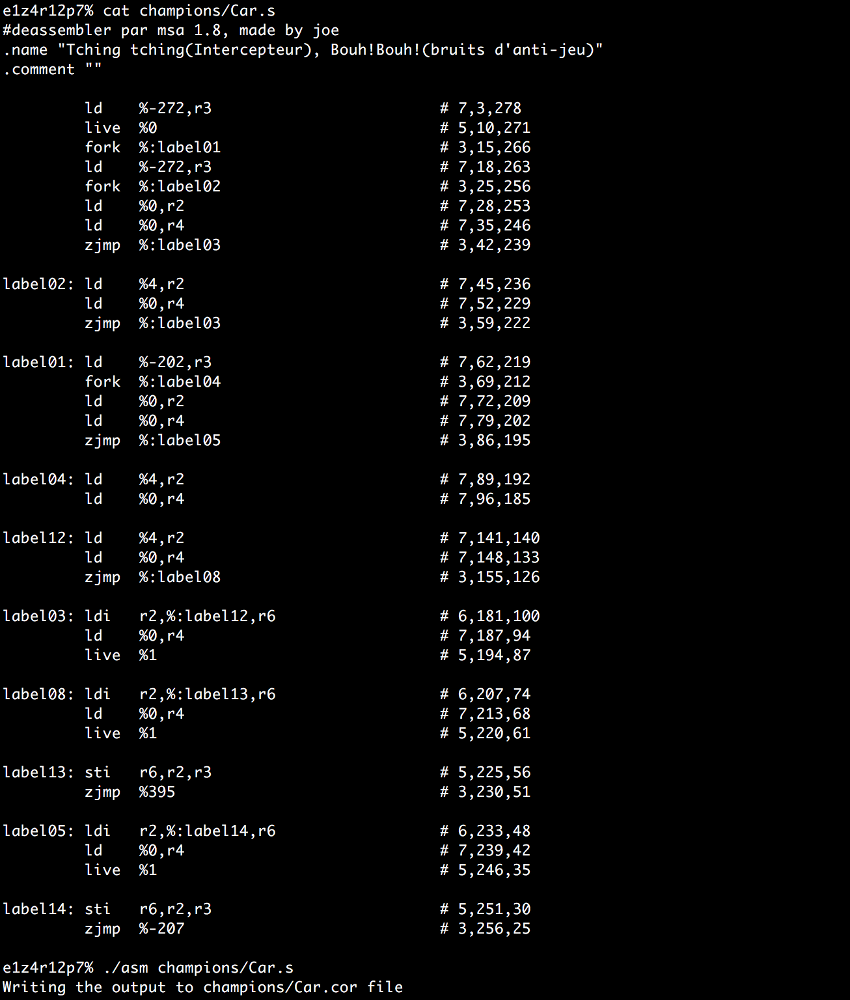
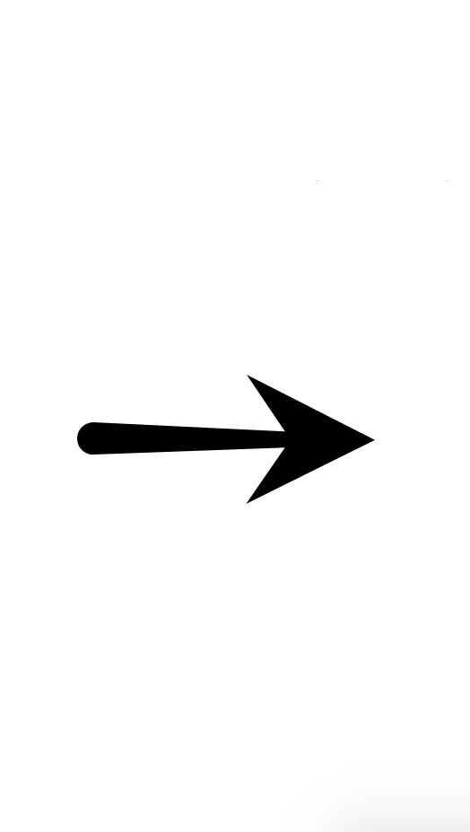
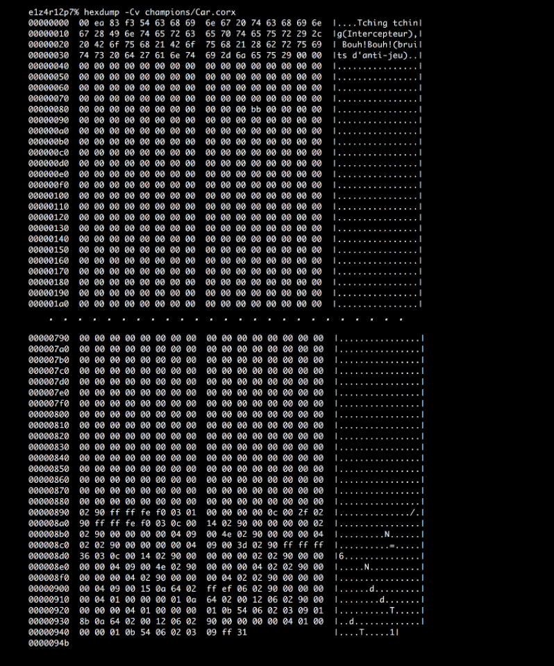

# Corewar - game demanding above-average intellect ⚔️🤺

Corewar is a game about writting the AI warriors/champions/viruses/players and running them in a special selected section of memory (so-called core). Two or more warriors are entered into the memory array at randomly chosen addresses and not knowing the enemies' positions, they have to defeat all of them and win a match. Each champ take turns, one by one, per which one instruction is executed. The end ensues when all the processes are dead; the last warrior reported to be “alive” wins the game. 🏆
 


## There are three parts Corewar can be broken down into:
* [**The assembler**](https://en.wikipedia.org/wiki/Assembly_language#Assembler): this program compiles given warriors and translates them from the language understendable for humanity (nerdly speaking **assembly language**) to the language readable for a virtual machine - [**Bytecode**](https://en.wikipedia.org/wiki/Bytecode), changing file extention from _.s_ to _.cor_. Moreover, assembly langueage of our choice (we didn't really have any choice) is neither Redcode, nor Bluecode nor Corewars, but 42Code (more info below).
* [**The virtual machine**](https://en.wikipedia.org/wiki/Virtual_machine): the circular memory arena in which the champions will be fighting - after crossing the highest avaliable address, it comes back to the first cell of memory. Each champ has some elements avaliable to use, i.e. [registries](https://en.wikipedia.org/wiki/Processor_register) - small memory “box” with one value (really fast in access! 💨). Every `CYCLE_TO_DIE` cycles, the machine makes sure each process has executed at least one live, thus reporting its alive. Moreover, `CYCLE_TO_DIE` will be decreased of `CYCLE_DELTA` units. The VM machine is [BIG ENDIAN](https://en.wikipedia.org/wiki/Endianness).
* **The champion**: this part is about creating a super powerful warrior that will beat the 💩out of the other champs based on the set of instruction it was given, simultaneously reporting itself as alive. If you plan on winning a game, I'd recommend to make sure your champion has IQ greater than a 🍌. 
</br>

## Assembler
<p float="left">
  
  
  
</p>
</br>

```
git clone git@github.com:psprawka/Corewar.git 42SV-Corewar
cd 42SV-Corewar/ASM
make 
./asm <your_champ.s>
```
The exemplary champs avaliable in `~/42SV-Corewar/ASM/champions/` directory.
</br></br>

   ## Made by [Terence](https://github.com/tle-huu) (VM) and [Me](https://github.com/psprawka) (ASM)  🇵🇱🇫🇷
</br>
